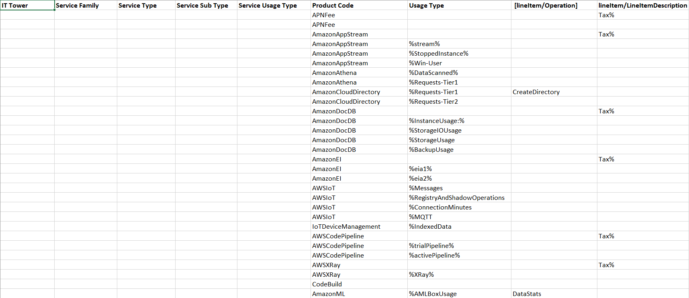

# Отчёт по лабораторной работе №1 (AWS). Вариант 5

## Цель работы
Знакомство с облачными сервисами. Понимание уровней абстракции над инфраструктурой в облаке. Формирование понимания типов потребления сервисов в сервисной-модели. 

## Дано: 
1. Слепок данных биллинга от провайдера после небольшой обработки в виде SQL-параметров. Символ % в начале/конце означает, что перед/после него может стоять любой набор символов.
2. Образец итогового соответствия, что желательно получить в конце.

## Задание
- [x] Импортировать файл .csv в Excel или любую другую программу работы с таблицами.
- [ ] Распределить потребление сервисов по иерархии, чтобы можно было провести анализ от большего к меньшему (напр. От всех вычислительных ресурсов Compute дойти до конкретного типа использования - Выделенной стойка в датацентре Dedicated host usage).

---
## Ход работы

### 1. Снимок данных биллинга

Импортируем .csv файл в Excel и увидем

### 2. Описание сервисов

### 3. Результат

---

## Вывод
Все пункты из задания были выполнены

##### Работу выполнил Иванов Семён
