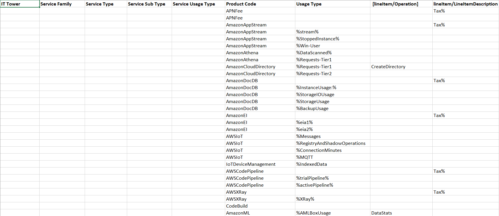
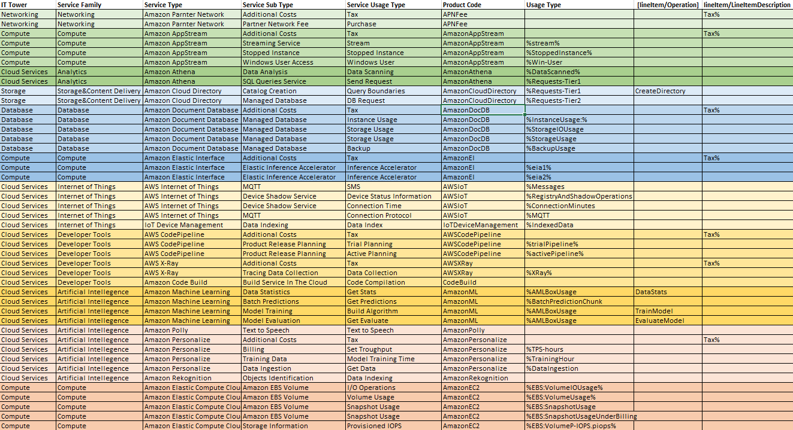

# Отчёт по лабораторной работе №1 (AWS). Вариант 5

## Цель работы
Знакомство с облачными сервисами. Понимание уровней абстракции над инфраструктурой в облаке. Формирование понимания типов потребления сервисов в сервисной-модели. 

## Дано: 
1. Слепок данных биллинга от провайдера после небольшой обработки в виде SQL-параметров. Символ % в начале/конце означает, что перед/после него может стоять любой набор символов.
2. Образец итогового соответствия, что желательно получить в конце.

## Задание
- [x] Импортировать файл .csv в Excel или любую другую программу работы с таблицами.
- [x] Распределить потребление сервисов по иерархии, чтобы можно было провести анализ от большего к меньшему (напр. От всех вычислительных ресурсов Compute дойти до конкретного типа использования - Выделенной стойка в датацентре Dedicated host usage).

---
## Ход работы

### 1. Снимок данных биллинга

Импортируем .csv файл в Excel и увидем

### 2. Описание сервисов

Воспользуясь [документацией](https://docs.aws.amazon.com/), опишем все сервисы из таблицы

#### 1. APN (Amazon Partner Network)
Глобальное сообщество, которое использует технологии, программы, экспертные знания и инструменты AWS для создания решений и услуг для клиентов

#### 2. AmazonAppStream (Amazon AppStream)
Сервис, который позволяет транслировать приложения с серверов на любое устройство с доступом в интернет. 

#### 3. AmazonAthena (Amazon Athena)
Сервис запросов, который позволяет вам анализировать данные, хранящиеся в Amazon S3, используя стандартный SQL

#### 4. AmazonCloudDirectory (Amazon Cloud Directory)
Сервис каталогов, который позволяет создавать и управлять структурами данных, такими как деревья, графы или иерархические структуры

#### 5. AmazonDocDB (Amazon DocumentDB)
Сервис, который упрощает настройку, эксплуатацию и масштабирование баз данных, совместимых с MongoDB

#### 6. AmazonEI (Amazon Elastic Inference)
Сервис, позволяющий подключать недорогое ускорение вывода на базе GPU к экземплярам EC2, SageMaker или задачам ECS.

#### 7. AWSIoT (AWS Internet of Things)
Набор облачных сервисов и инструментов, которые позволяют строить, развертывать и управлять решениями для Интернета вещей.

#### 8.IoTDeviceManagement (IoT Device Management)
Сервис, который обеспечивает управление жизненным циклом IoT-устройств, начиная с их ввода в эксплуатацию и заканчивая выводом из нее

#### 9. AWSCodePipeline (AWS CodePipeline)
Сервис CI/CD, который автоматизирует этапы компоновки, тестирования и развертывания при каждом изменении в коде

#### 10. AWSXRay (AWS X-Ray)
Сервис для анализа и отладки производительности распределенных приложений, которые построены на микросервисной архитектуре.

#### 11. CodeBuild (Amazon Code Build)
Сервис для непрерывной интеграции, который автоматизирует процесс сборки исходного кода в готовый к развертыванию артефакт

#### 12. AmazonML (Amazon Machine Learning)
Сервис для построения моделей машинного обучения и создания прогнозов

#### 13. AmazonPolly (Amazon Polly)
Сервис, который генерирует голос по запросу и преобразует любой текст в аудиопоток

#### 14. AmazonPersonalize (Amazon Personalize)
Сервис, основанный на машинном обучении, который использует данные для создания рекомендаций по товарам для пользователей
 
#### 15. AmazonRekognition (Amazon Rekognition)
Сервис распознавания изображений, который определяет объекты, сцены, действия, достопримечательности, лица, доминирующие цвета и качество изображения

#### 16. AmazonEC2 (Amazon Elastic Compute Cloud)
Сервис, предоставляющий виртуальный компьютер и изменяемую вычислительную ёмкость в облаке

### 3. Результат

---

## Вывод
Все пункты из задания были выполнены

##### Работу выполнил Иванов Семён
