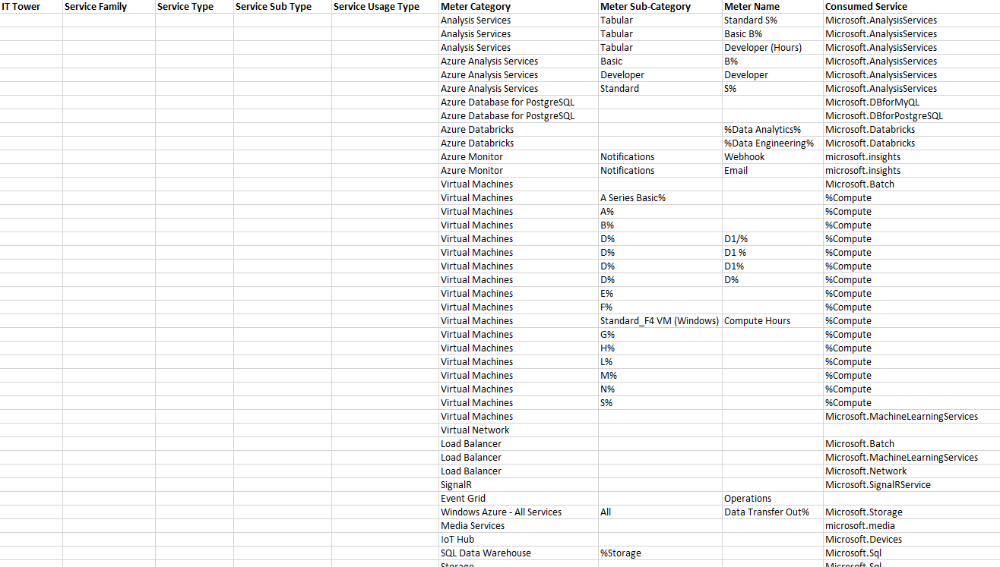
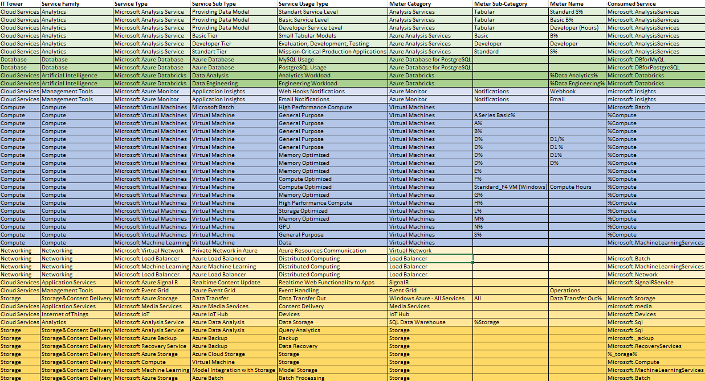

# Отчёт по лабораторной работе №2 (Azure). Вариант 5

## Цель работы
Получение навыков аналитики и понимания спектра публичных облачных сервисов без привязки к вендору. Формирование у студентов комплексного видения Облака. 

## Дано: 
1. Данные лабораторной работы 1.
2. Слепок данных биллинга от провайдера после небольшой обработки в виде SQL-параметров. Символ % в начале/конце означает, что перед/после него может стоять любой набор символов.
3. Образец итогового соответствия, что желательно получить в конце. В этом же документе 

## Задание
- [x] Импортировать файл .csv в Excel или любую другую программу работы с таблицами. Для Excel делается на вкладке Данные – Из текстового / csv файла – выбрать файл, разделитель – точка с запятой.
- [x] Распределить потребление сервисов по иерархии, чтобы можно было провести анализ от большего к меньшему (напр. От всех вычислительных ресурсов Compute дойти до конкретного типа использования - Выделенной стойка в датацентре Dedicated host usage). При этом сохранять логическую концепцию, выработанную в Лабораторной работе 1.

---
## Ход работы

### 1. Снимок данных биллинга

Импортируем .csv файл в Excel и увидем

### 2. Описание сервисов

#### 1. Azure Analysis Service
Платформа для анализа данных и бизнес аналитики

#### 2. Azure Database
Платформа для управления реляционными базами данных 

#### 3. Azure Databricks
Платформа для аналитики данных на основе машинного обучения

#### 4. Azure Monitor
Решение для мониторинга данных, их обработки и отображения

#### 5. Microsoft Virtual Machines
Сервис для управления виртуальными машинами под разные задачи

#### 6. Microsoft Machine Learning
Сервис, предоставляющий инструменты для машинного обучения

#### 7. Microsoft Virtual Networks
Сервис для создания у управления виртуальными сетями

#### 8. Microsoft Load Balancer
Сервис для балансировки входящего трафика

#### 9. Azure Signal-R
Сервис, добавляющий realtime веб функционал в приложения

#### 10. Microsoft Event Grid
Сервис для маршрутизации событий между приложениями

#### 11. Microsoft Media Services
Платформа для трансляции медиа ресурсов на устройства

#### 12. Microsoft Azure Storage
Платформа для хранения данных в облаке

#### 13. Microsoft IoT
Сервис для управления устройствами интернета вещей

#### 14. Microsoft Azure Backup
Сервис для автоматических быкапов данных

---

### 3. Результат

---

## Вывод
Все пункты из задания были выполнены

##### Работу выполнил Иванов Семён
