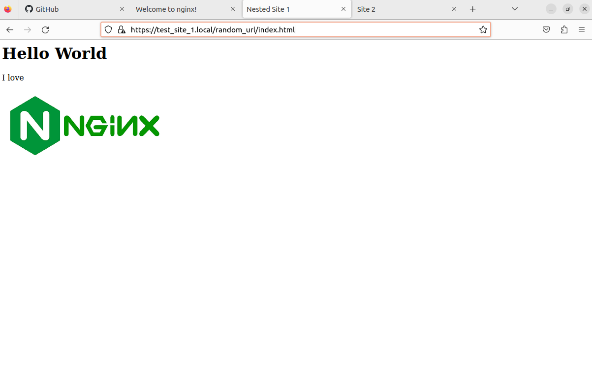

# Отчёт по лабораторной работе №1

## Задание
- [x] Nginx должен работать по https c сертификатом
- [x] Настроить принудительное перенаправление HTTP-запросов (порт 80) на HTTPS (порт 443) для обеспечения безопасного соединения.
- [x] Использовать alias для создания псевдонимов путей к файлам или каталогам на сервере.
- [x] Настроить виртуальные хосты для обслуживания нескольких доменных имен на одном сервере.

---

### 1. Установка Nginx

Для начала установим Nginx с помощью команды `sudo apt-get install nginx`

Теперь узнаем свой ip адрес с помощью команды `ip addr`

Вводим наш айпишник в строку браузера и пробуем подключиться к серверу. Nginx работает, так что можно двигаться дальше

---

### 2. Настройка Nginx

Перейдём в директорию `/var/www`. В ней будут храниться странички наших тестовых сайтов. Теперь создадим 2 новых папки с именами `test_site_1` и `test_site_2` и добавим в них HTML файлы c hello world

Самое время написать конфиги. Перейдём в директорию `/etc/nginx/sites-available` и создадим там 2 файла с конфигурациями `test_site_1` и `test_site_2`

Чтобы Nginx мог обслуживать наши сайты, нужно создать символические ссылки на эти конфиги в `/etc/nginx/sites-enabled/`

Запускаем ... И ничего не работает, страницы не найдены. Нужно добавить хосты. В файле `hosts` пропишем адреса наших сайтов

Теперь перезагрузим Nginx командой `sudo service nginx restart` и попробуем подключиться вновь

Как видим, всё работает, но подключение небезопасно, так как мы используем протокол HTTP, а не HTTPS. Нужно это исправлять

---

### 3. Настройка HTTPS подключения

Чтобы сгенерировать SSL сертификат, нам понадобится openssl. Установим его

Теперь сгенерируем сам сертификат

Перепишем наши старые конфиги, добавив в них перенаправление с порта 80 на порт 443 

Попробуем подключиться. Браузер выдаёт предупреждение. Не обращаем внимания и подключаемся

Теперь HTTPS. Ура

---

### 4. Добавление alias 

---

## Вывод
Все пункты из задания были выполнены. В качестве проектов были использованы простые html странички с текстом. 

##### Работу выполнил Иванов Семён
