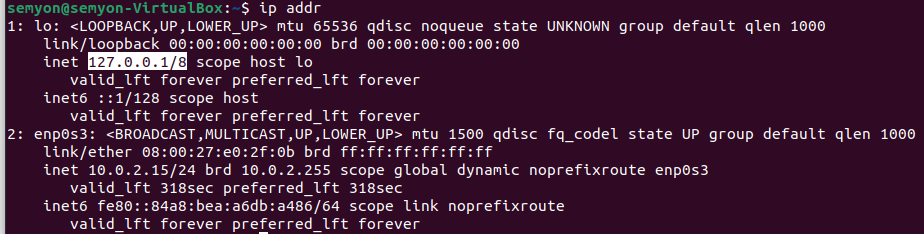

# Отчёт по лабораторной работе №1

## Задание
- [x] Nginx должен работать по https c сертификатом
- [x] Настроить принудительное перенаправление HTTP-запросов (порт 80) на HTTPS (порт 443) для обеспечения безопасного соединения.
- [x] Использовать alias для создания псевдонимов путей к файлам или каталогам на сервере.
- [x] Настроить виртуальные хосты для обслуживания нескольких доменных имен на одном сервере.

---

### 1. Установка Nginx

Для начала нужно установить Nginx

Теперь узнаем свой ip адрес

---

## Вывод
Все пункты из задания были выполнены. В качестве проектов были использованы простые html странички с текстом. 

##### Работу выполнил Иванов Семён
