# Отчёт по лабораторной работе №1

## Задание
- [x] Nginx должен работать по https c сертификатом
- [x] Настроить принудительное перенаправление HTTP-запросов (порт 80) на HTTPS (порт 443) для обеспечения безопасного соединения.
- [x] Использовать alias для создания псевдонимов путей к файлам или каталогам на сервере.
- [x] Настроить виртуальные хосты для обслуживания нескольких доменных имен на одном сервере.

---

### 1. Установка Nginx

Для начала нужно установить Nginx
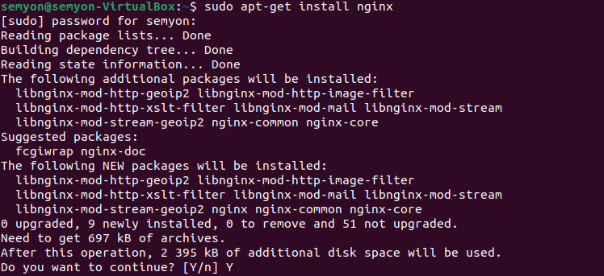

Теперь узнаем свой ip адрес
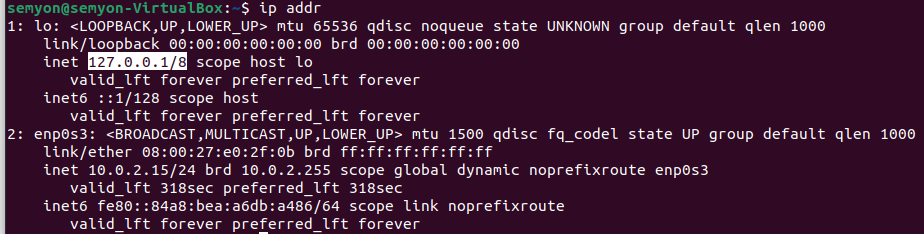

Пробуем подключиться
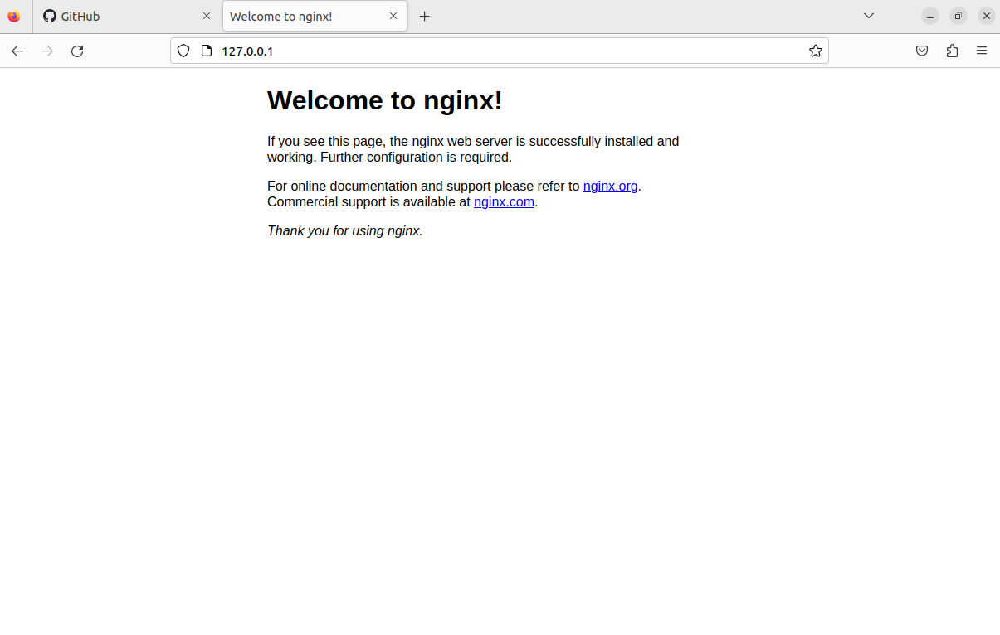

---

### 2. Настройка Nginx

Перейдём в директорию `/var/www`

Создадим 2 новых папки, в которых будут храниться странички наших сайтов
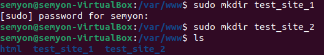

А теперь напишем и сами странички c hello world

Самое время написать конфиги 
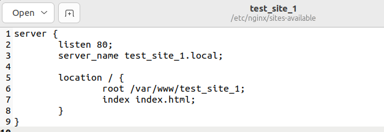

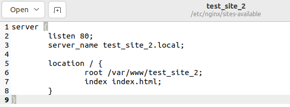

Чтобы Nginx обслуживал наши сайты, нужно создать символические ссылки на файлы конфигурации `test_site_1` и `test_site_2` в `/etc/nginx/sites-enabled/`

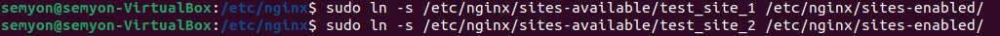

Запускаем ... И ничего не работает. Нужно добавить хосты

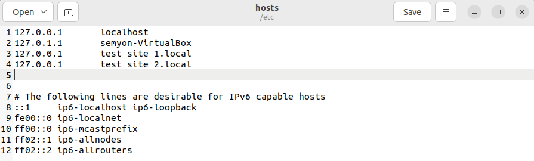

Теперь перезагрузим Nginx командой `sudo service nginx restart` и попробуем подключиться вновь

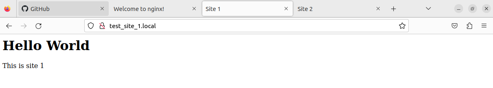

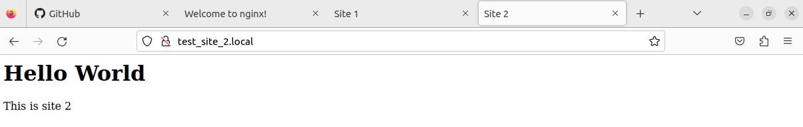

Как видим, всё работает, но подключение небезопасно, так как мы используем протокол HTTP, а не HTTPS. Нужно это исправлять

---

### 3. Настройка HTTPS подключения

Чтобы сгенерировать SSL сертификат, нам понадобится openssl. Установим его
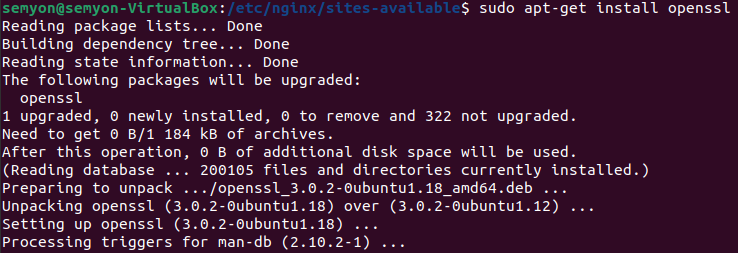

Теперь сгенерируем сам сертификат
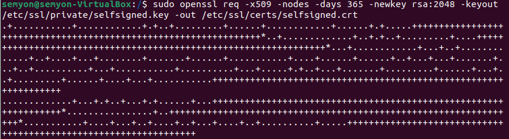

Перепишем наши старые конфиги, добавив в них перенаправление с порта 80 на порт 443 
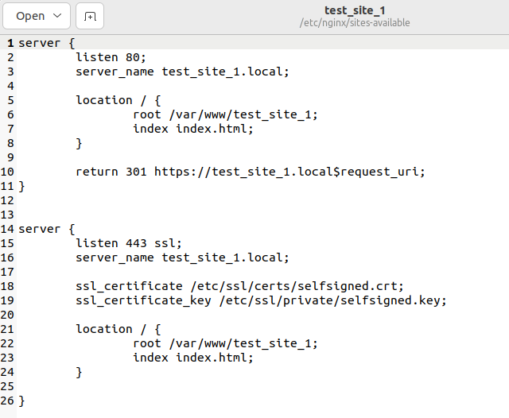
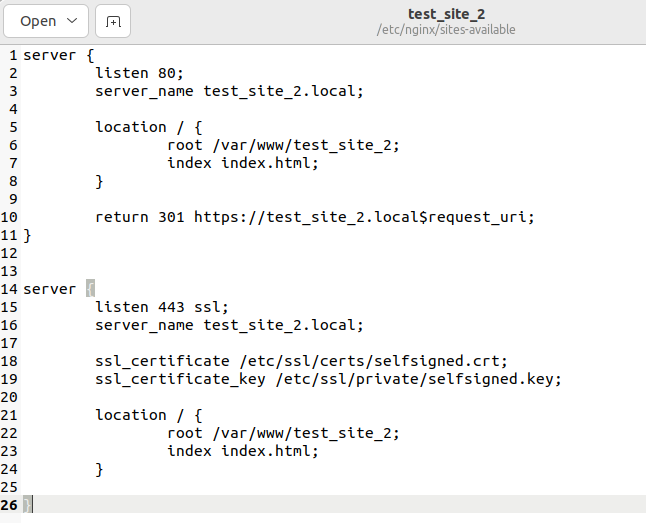

Попробуем подключиться. Браузер выдаёт предупреждение. Не обращаем внимания и подключаемся

Теперь HTTPS. Ура

---

### 4. Добавление alias 

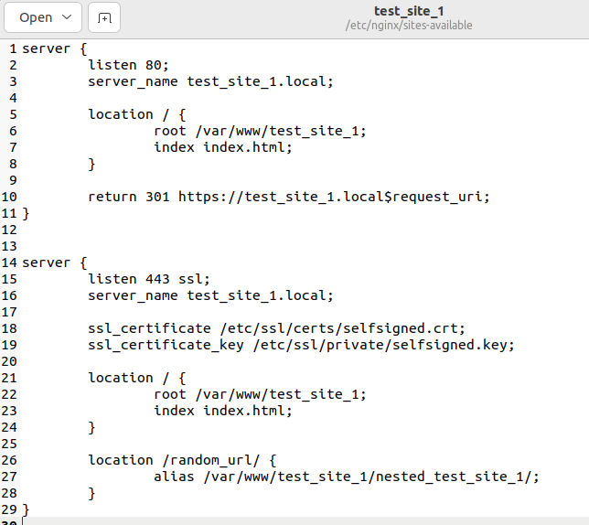
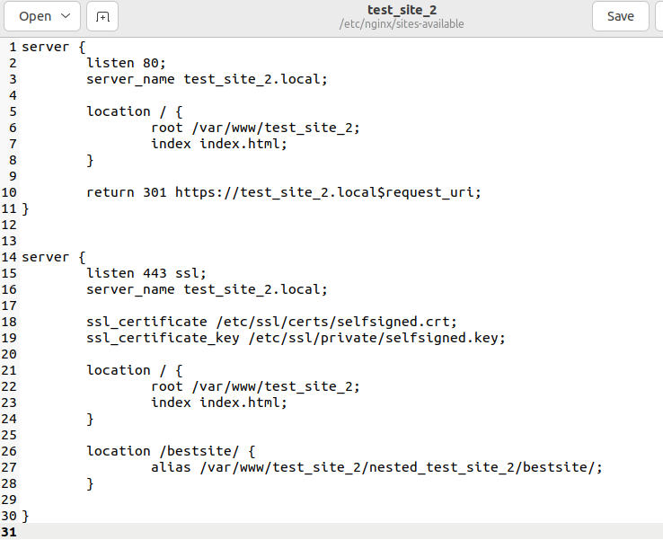

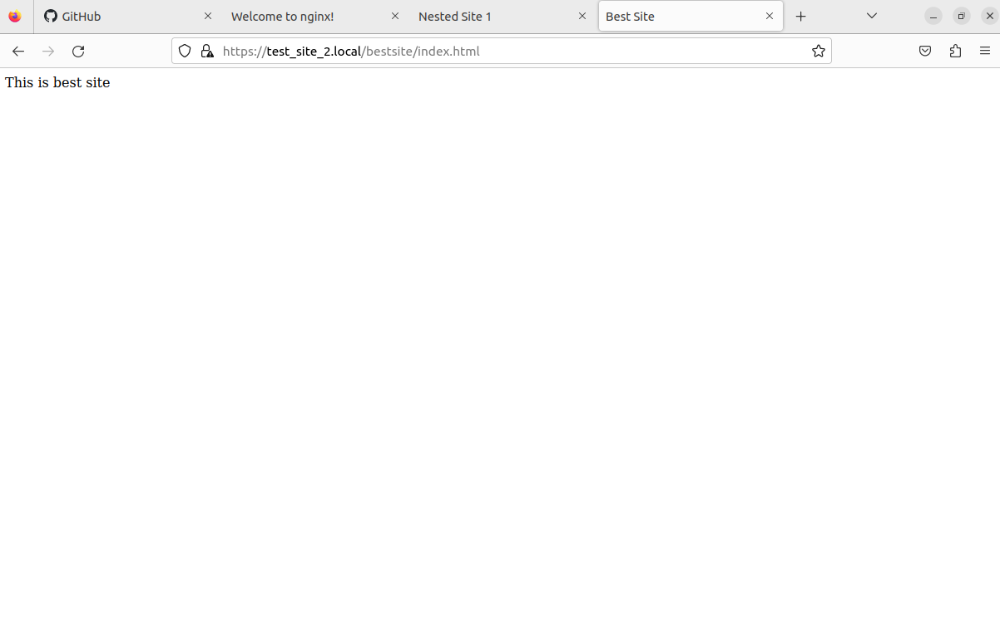

---

## Вывод
Все пункты из задания были выполнены. В качестве проектов были использованы простые html странички с текстом. 

##### Работу выполнил Иванов Семён
