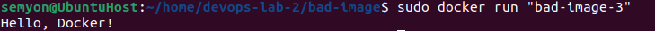
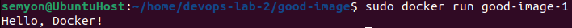

# Отчёт по лабораторной работе №2

## Задание
- [x] Написать “плохой” Dockerfile, в котором есть не менее трех “bad practices” по написанию докерфайлов
- [x] Написать “хороший” Dockerfile, в котором эти плохие практики исправлены
- [x] В Readme описать каждую из плохих практик в плохом докерфайле, почему она плохая и как в хорошем она была исправлена, как исправление повлияло на результат
- [x] В Readme описать 2 плохих практики по работе с контейнерами

---

### 1. Установка Docker

Сначала нужно установить Docker на нашу машину. Для этого воспользуемся инструкциями с [этого сайта](https://docs.docker.com/engine/install/ubuntu/)

---

### 2. Плохой Dockerfile

Теперь напишем плохой Dockerfile. 

```Dockerfile
FROM python:latest

COPY . .

USER root

CMD python3 main.py
```

Создадим образ командой `sudo docker build -t "bad-image-3" .` и запустим контейнер командой `sudo docker run "bad-image-3"`




Ну так работает же ...

### Почему так делать не надо:
1. **Использовать тег latest** плохо, потому что последние версии могут быть нестабильными или несовместимыми с текущими зависимостями
2. **Не указана рабочая директория**, а это нехорошо, потому что все исходники должны храниться в одном месте
3. **Рекурсивное копирование всех файлов** приведёт к тому что будет много ненужных данных, увеличивающих вес образа
4. **Использование рут прав без необходимости** опасно, ведь злоумышленники могут атаковать контейнер и получить доступ ко всем root привилегиям 
5. **Запуск строковой формой** ведёт к тому, что Docker запускает процесс с использованием bash, что может привести к неправильной обработке сигналов

---

### 3. Хороший Dockerfile

Теперь перепишем докерфайл, используя хорошие практики:

```Dockerfile
FROM python:3.13-slim

WORKDIR /app

COPY /main.py .

RUN useradd -ms /bin/bash newuser

USER newuser

CMD ["python3", "main.py"]
```

Теперь снова запустим контейнер, чтобы убедиться, что своими улучшениями мы ничего не поломали



### Почему так делать надо:
1. **Использование конкретной версии базового образа** нужно для обеспечения стабильной работы контейнера, к тому же slim весит меньше
2. **Указание рабочей директории** обеспечит выполнение всех инструкций в контексте выбранного каталога, а не где придётся
3. **Копирование только нужных файлов** позволит уменьшить итоговый размер образа
4. **Использование юзера без root прав** нужно для обеспечения безопасности и защиты от атак
5. **Использование exec формы инструкции CMD** обеспечит корректную работу и остановку контейнера

---

### 4. Bad practices по работе с контейнерами

1. **Хранить данные в контейнерах**. Данные живут пока живёт контейнер, поэтому при завершении работы контейнера все данные потеряются.
2. **Пихать в один контейнер много разных процессов**. Не стоит так делать, потому что можно столкнуться с непредвиденными сложностями и проблемами в настройке, к тому же это затруднит отладку. Контейнеры нужно использовать строго для выполнения одного процесса.

---

## Вывод
Все пункты из задания были выполнены. В ходе работы были написаны плохой и хороший докерфайлы, а также приведены плохие практики по работе с контейнерами 

##### Работу выполнил Иванов Семён
