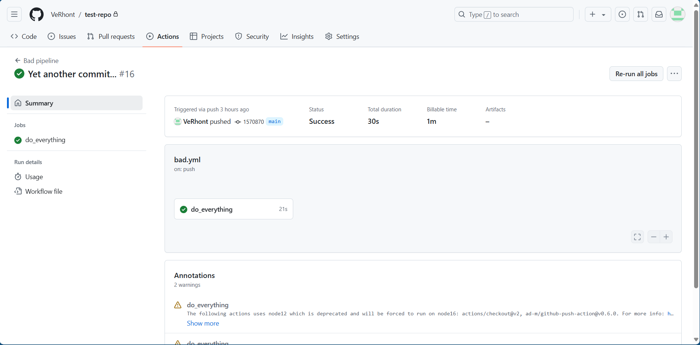
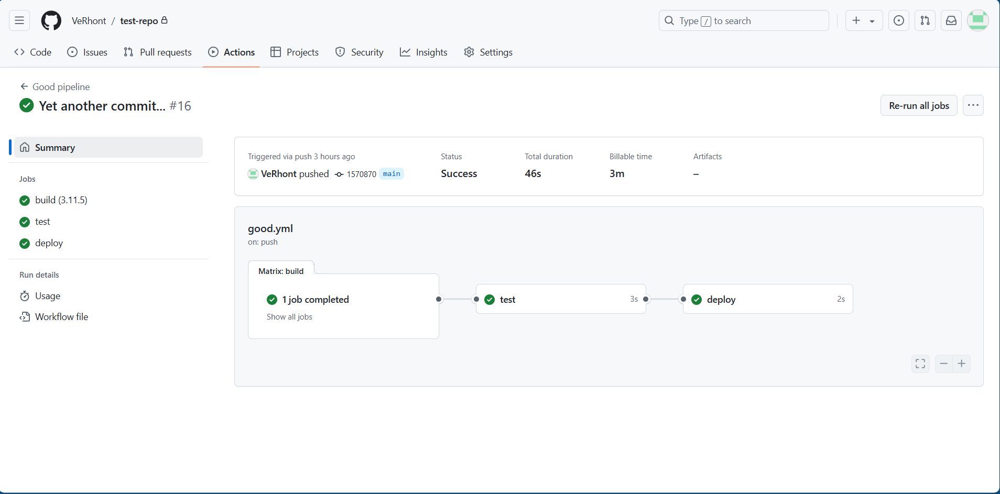

# Отчёт по лабораторной работе №3

## Задание
- [x] Написать “плохой” CI/CD файл, который работает, но в нем есть не менее пяти “bad practices” по написанию CI/CD
- [x] Написать “хороший” CI/CD, в котором эти плохие практики исправлены
- [x] В Readme описать каждую из плохих практик в плохом файле, почему она плохая и как в хорошем она была исправлена, как исправление повлияло на результат

---

### 1. Настройка

Для начала создадим простенький проект на python с помощью которого будем обращаться к [openweathermap.org](https://openweathermap.org/) и получать данные о погоде. В директории `.github/workflows` добавим 2 файла: `bad.yml` и `good.yml`, в котором мы и будем описывать весь pipeline. В качестве CI/CD инструмента будем использовать GitHub Actions

---

### 2. Плохой CI/CD файл

```YAML
name: Bad pipeline

on:
  push:

jobs:
  do_everything:
    runs-on: ubuntu-latest
    steps:
      - name: setup
        uses: actions/checkout@v2

      - name: setup
        uses: actions/setup-python@v4
        with:
          python-version: 3.11.5

      - name: install
        run: |
          python -m pip install --upgrade pip
          pip install -r requirements.txt

      - name: test
        run: |
          python test.py

      - name: execute script
        env:
          API_TOKEN: "a4819dks02881ud8194hn130021" # (токен не настоящий)
        run: python main.py

      - name: commit files
        run: |
          git config --local user.email "action@github.com"
          git config --local user.name "GitHub Action"
          git add -A
          git diff-index --quiet HEAD || (git commit -a -m "updated logs" --allow-empty)

      - name: push changes
        uses: ad-m/github-push-action@v0.6.0
        with:
          github_token: ${{ secrets.GITHUB_TOKEN }}
          branch: main
```

##### Оно работает!



##### Плохие практики в этом файле:

1. В моменте `on: push:` мы запускаем пайплайн на любой push в любую ветку, что может быть излишним и занимать много времени
2. Мы используем всего лишь один большой и перегруженный job `do_everything`, в котором происходи всё. Это затрудняет процесс отладки, к тому же выполнение такого пайплайна займёт больше времени
3. Шагам даны неинформативные и повторяющиеся имена, такие как `setup`. Это затруднит отладку при возникновении ошибок, ведь нам будет сложнее понять, в каком месте что-то пошло не так 
4. Секрет `API_TOKEN` хранится прямо в коде. Это очень небезопасно, потому что любой сможет его узнать и использовать в своих корыстных целях
5. Использование старых версий `actions/checkout@v2`, `actions/setup-python@v4`, `ad-m/github-push-action@v0.6.0` нежелательно из-за потенциальных ошибок
6. В файле мы захардкодили версию python `python-version: 3.11.5`. При необходимости нам придётся изменять её вручную во всех местах, где она указана
7. Отсутствие кэширования зависимостей

---

### 3. Хороший CI/CD файл

```YAML
name: Good pipeline

on:
  push:
    branches:
      [main]

jobs:
  build:
    strategy:
      matrix:
        python-version: [ 3.11.5 ]
    runs-on: ubuntu-20.04
    steps:
      - name: checkout repo content
        uses: actions/checkout@v4

      - name: setup python
        uses: actions/setup-python@v5
        with:
          python-version: ${{ matrix.python-version }}
          cache: 'pip'

      - name: install python packages
        run: |
          python -m pip install --upgrade pip
          pip install -r requirements.txt

      - name: execute script
        env:
          API_TOKEN: ${{ secrets.API_TOKEN }}
        run: python main.py

  test:
    runs-on: ubuntu-20.04
    needs: build
    steps:
      - name: checkout repo content
        uses: actions/checkout@v4
      - name: run tests
        run: |
          python test.py

  deploy:
    runs-on: ubuntu-20.04
    needs: test
    steps:
      - name: checkout repo content
        uses: actions/checkout@v4

      - name: commit files
        run: |
          git config --local user.email "action@github.com"
          git config --local user.name "GitHub Action"
          git add -A
          git diff-index --quiet HEAD || (git commit -a -m "updated logs" --allow-empty)

      - name: push changes
        uses: ad-m/github-push-action@v0.8.0
        with:
          github_token: ${{ secrets.GITHUB_TOKEN }}
          branch: main
```

##### Всё ещё работает 



##### Исправление плохих практик

1. Чётко указано, что нужно запускать пайплайн только при пуше в main. Больше никаких ненужных действий и предупреждений
2. Весь pipeline разбит на 3 джоба: `build`, `test`, `deploy`. Это поможет лучше структурировать тестирование 
3. Всем шагам даны понятные и уникальные имена. Теперь всё понятно и очевидно
4. Секрет хранится безопасно и больше никто не сможет его украсть
5. Использование новых версий `actions/checkout@v4`, `actions/setup-python@v5`, `ad-m/github-push-action@v0.8.0` обеспечит стабильную работу программы
6. Использована strategy: `matrix: python-version [ 3.11.5 ]`. Это позволит избежать ошибок из-за несостыковок версий
7. Указана конкретная версия OS
8. Добавление кэширования зависимостей

---

## Вывод
Все пункты из задания были выполнены. В ходе работы были написаны CI/CD файл с использованием плохих практик, а также исправленный CI/CD файл с использованием лучших практик

##### Работу выполнил Иванов Семён
